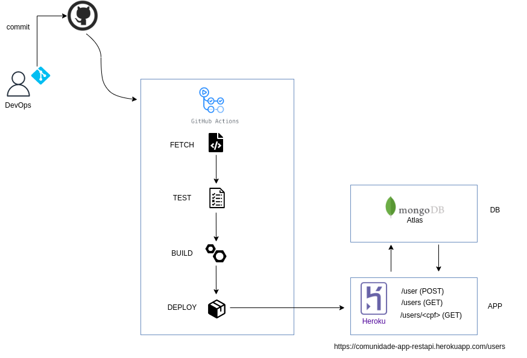

## 💡 Idea
Through a simple application in Python using Rest API, the application can do user creation, ID validation and validate the user within the database, hosted on MongoDB Atlas and the application hosted on Heroku.

---

### 🛠️ Worked wuth
* REST
* Flake8
* Docker
* Docker Compose
* Make
* MongoDB Atlas
* Heroku
---

### 🧾 Prerequisites
* Docker
* Docker Compose
* Python
* Heroku CLI
* MongoDB API
---